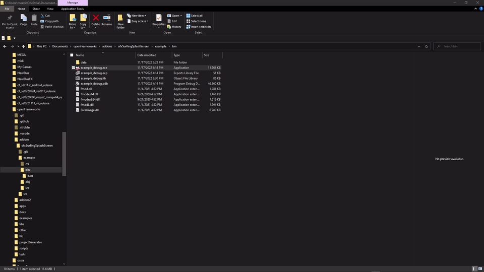
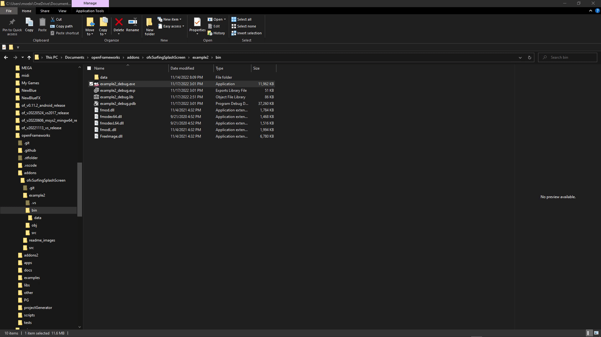

# ofxSurfingSplashScreen
[](https://opensource.org/licenses/MIT)

## Overview
An **openFrameworks** addon to trigger a faded-out splash image. Typically when starting an `oF_App`, but working during runtime too.

## Screencast

### NON FLOATING MODE


### FLOATING MODE


## Features
- Floating and borderless mode. (WIN32 Only)
- Faded Out on non Floating mode.
- Can be triggered by code during runtime.
- Can disable all other app drawings during splash.
- NOT multi-threading nor drawing during `setup()` for "longer loading" apps.

## Usage

* Look example.

```.cpp	
#include "ofxSurfingSplashScreen.h"

ofxSurfingSplashScreen splash;

void ofApp::setup()
{
	// Set non floating mode
	//splash.setModeFloating(false); 

	// Pick your image
	splash.setup("assets/images/Paletto_Banner.png");
}

void ofApp::draw(){
{
	if (splash.draw()) return;
	// Can skip other drawings during splash 

	/* Draw your scene */
}

	// Manual trig splash
	splash.start();
```

## TODO:
* Fix a small flick when transitioning window sizes on floating mode.
* Rescale drawing when the image is bigger than the window.
* Add multithreading to allow drawing during slow setups.
* Add a transparent window using PNGs with alpha.  

## Tested Systems
* **Windows 10** / **VS 2017** / **OF ~0.11**

## Author
An addon by **@moebiusSurfing**  
*( ManuMolina ) 2022*  

## License
**MIT License**